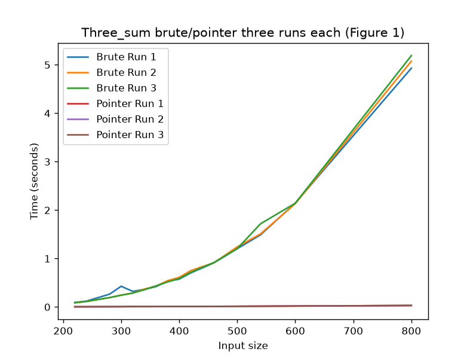
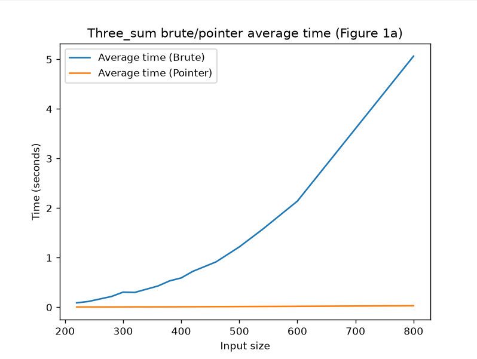
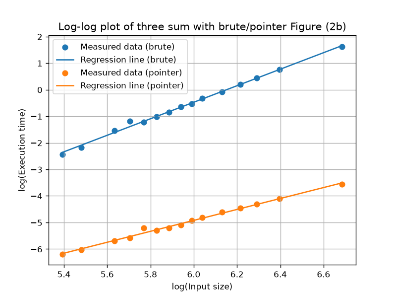
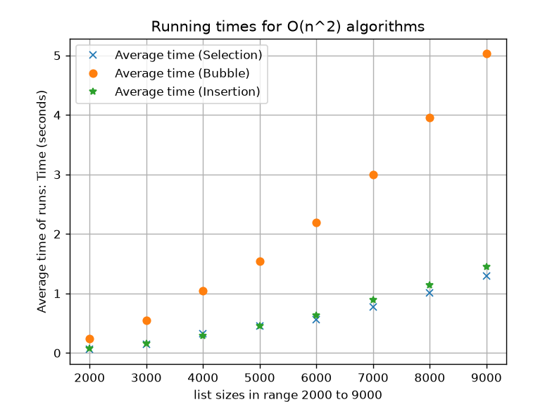
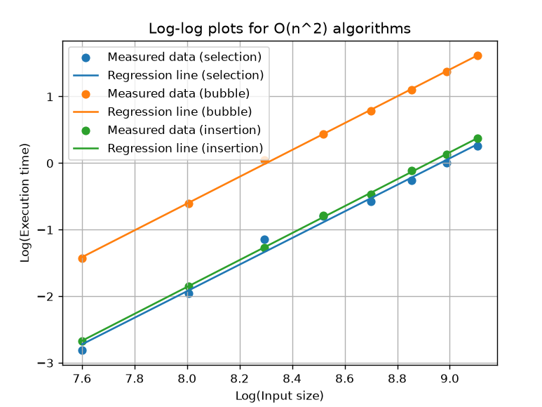
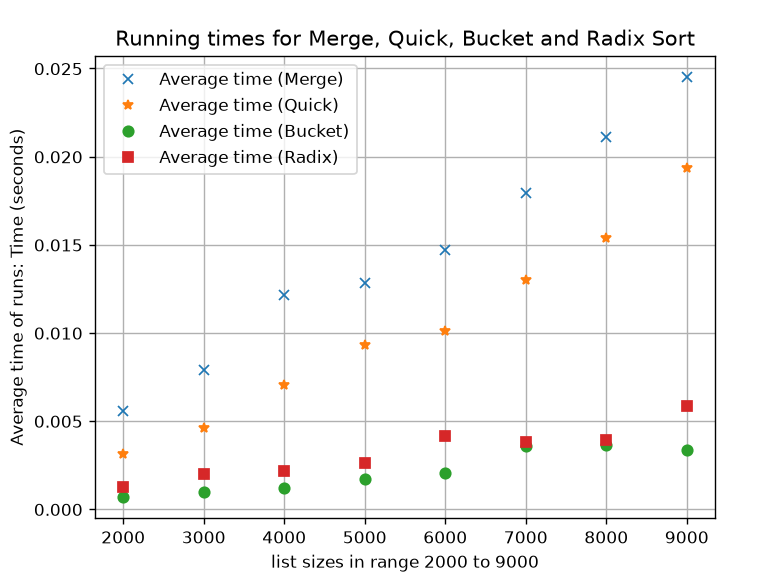
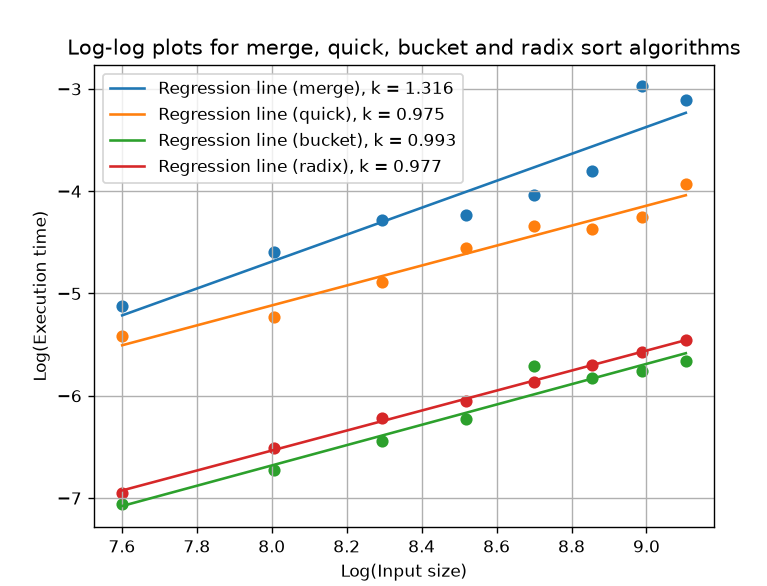

# Part 3 - Report

## Part 1

### 1.1 Explain how you conducted your threesum experiments.
Before the experiments themselves the first thing I did was to start implementing the `threesum_brute` algorithm in the **threesum_algorithms.py** file. From research and previous course material I realized that I was gonna need three different loops to check all possible combinations of three elements. I also needed a list to store the actual result of the three sum numbers in. So for that I created the variable result which is an empty list/array to start with. I also created a lst variable that basically uses the built in sorted method that works really well for sorting the lst in the proper order. For the three loops for every run I use the triple variable to store the triples and then I append them to the result list if they are not already in the result to avoid duplicates.

The `threesum_pointer` method on the other hand follows the same basic principle but uses a way faster approach to search for the triples more efficiently. For the threesum_pointer method you start the same way as the brute force solution with creating a result list and a sorting a input list. Instead of using the three nested loops that are really slow, the pointer method uses the two pointers left and right. The left pointer starts at the element that comes after **i** meanwhile the right pointer starts at the last element in the list. The three values then get added together in the current_sum variable and compared with the target sum we are looking for.

It goes sort of like this, if the current_sum is equal to the target, the triple is added to the result and both pointers are moved towards the middle of the list. Then if the current_sum is smaller than the target we are looking for you move the left pointer one step to the right to them basically increase the sum, then the last case is if the current_sum is larger that the target the right pointer is moved to the left to decrease the sum. This approach helps with not running the algorithms fdor numbers in the list that arent evena  possibility as a three sum. So when you run the experiments you can compare the two different algorithms and clearly see that the pointer algorithm is so much faster than the simple brute force approach.

For the experiments themselves in the `threesum_experiments.py` file, I used randomly generated lists with 15 different sizes with the smallest being 220 elements and the biggest being 800 elements. The values in the list were randomly generated via the `import random` module. I generated a new random list for each input size and measured the run time of each run via pythons built in `time.perf_counter()` function.

Three different runs were performed for  both the pointer and brute force algorithms, this is good because it gives the results and comparisons more reliable and you can clearly see the difference and similarities between each run. For every input size, I save the execution time then calculate the average time of the three runs separately for each och the algorithms.

For Figure 1 I used **matplotlib** to plot a three runs in the graph for both pointer and brute force algorithms. This resulted in three lines for each of the algorithms with clear visible differences. The graph shows that the execution time is similar for all 3 brute force runs when compared with eachother and that they dont fluctuate much at all, But when you compare the brute force lines to the pointer algorithm runs you can clearly tell that the pointer algorithm is much faster especially for bigger input sizes.

The next step was to use linear regression to basically analyse the relation between execution time and input size of the list. For this I implemented the `lin_reg(x, y)` method whose job is to calculate the slope (k) and the intercept point(m) for the equation y = m+kx.

To then estimate the time complexity via the natural logarithm I transformed both the input size and average execution time. A log_x variable was created for the input sizes, while log_y_brute and log_y_pointer were created for the average execution times of the two different algorithms.

Finally I calculated the values for the regression line using the m and k values from the log-log regression. Then to get Figure 2b I plotted the logarithmic data as points and added a regression line for both pointer and brute force algorithms. The values of k from the log-log regressions are then used to estimate the time complexity of the pointer and brute force algorithms.

### 1.2 Explain your results and comparisons.
The experiments were great to do because they showed a clear difference between brute force and pointer algorithm implementations. As the input size got bigger, the execution time of the brute force algorithm got really slow while the pointer algorithm was able to handle the bigger sizes much faster and smoother.

The gap between the two algorithms grew quickly as the input size increased. At 800 elements the brute force algorithm took around 5.4 seconds compared to around 0.0295 seconds for the pointer algorithm, a difference of roughly 200 times. This is also represented in the K values from the log-log regression, 3.1023 for brute force and 2.0913 for pointer, which line up closely with the theoretical O(n³) and O(n²) time complexities. This confirms that the pointer algorithm is not just faster in practice but actually scales way better as the input size gets bigger aswell.

## Figure 1 - Three separate runs for brute force and pointer threesum algorithms

 

Figure one shows six runs in total, three for brute force and three for pointer. Represented by lines in the graph. The three runs for each algorithm follow a similar pattern, although there may be some very small differences in execution between runs. The differences are expected because of the simple fact that execution time can be affected by other processen running on the computer etc.

The main difference you can see ehen looking at figure 1 is that the brute force algorithm becomes much slower as the input size increases while the pointer algorithm remains fast even at big input sizes. At an input size of 800 the brute force algorithm took around 5.4 seconds while the pointer algorithm took around 0.0295 seconds which is a significant difference.

This shows that the pointer algorithm handles increasing input sizes much more efficiently than the bruteforce algorithm.

## Figure 1a - Average execution time

 

Figure 1a shows the average execution time of the three runs for each of the input sizes. Calculating the average makes the comparison really clear because small variations between different runs gave less influence on the actual result.

The graph yet again shows that the brute force algorithm increases much more rapidly in execution time compared to the execution time of the pointer algorithm. The difference yet again becomes even clearer the bigger the input size is.

The main reason for this difference is that the brute force algorithm has to check all different combinations while the pointer algorithm uses a sorted list and two pointers to basically ignore certain combinations that are impossible to be a combination we are looking for.

## Figure 2b - Log-log regression

 

Figure 2b shows the measured execution times after applying a natural logarithm to the input size and execution time. After that I applied a linear regression to the logarithmic data.

The slope (k) can be used to estimate the time complexity, the brute force algorithm got a measured value of k = 3.1023 meanwhile the pointer algorithm got a measured value of k = 2.0913. This is the sort of data I was looking for since the brute force algorithm was close to three which corresponds to the time complexity of O(n³). The pointer value on the other hand is close to two which corresponds to a quadratic time complexity of O(n²).

The results gotten from the experiments therefore support and agree with the theoretical time complexities of both brute and piinter algorithms. The result also helps us understand why the execution times between the algorithms are so different in both Figure 1 and Figure 1a. So to sum it up, when the input size increases the brute force algorithm becomes much slower while the pointer algorithm keeps most of its speed.

### 1.3 Show how you mathematically arrived at your results.
To get the estimated time complexity which is represented by K I first took the input sizes to get the average execution time from the experiments. Then the natural logarithm for both average execution time and input size was calculated.

These logarithmic values are then used in a linear regression which gives the k value. K is used to estimate how quickly execution time grows when input size expands. A value close to three means cubic growth or thereabouts while a value closer to two means quadratic grwoth or thereabouts.

For the brute force algorithm the value of K I got is:

- k = 3.1023

For the pointer algorithm the value of k I got is:

- k = 2.0913

These results indicate that the experimental results supports the time complexities expected which are O(n³) for brute force and O(n²) for pointer.

### 1.4 Explain (in an appropriate manner) how your choice of cache or pointer works.
My `threesum_pointer method` first sorts the list. Then it uses three things basically, one fixed element as well as two pointers. The right pointer starts at the end of the list while the left starts directly after the fixed element. The variable `current_sum` is used and compared with the target which in this case is 0, this comparison makes it so that the algorithm can decide which pointer should be moving.

If the `current_sum` is to small that means the left pointer moves to the right to increase the `current_sum` and if the `current_sum` too big, the right pointer moves to the left to decrease the value and try to find a match with the target we are looking for. Then the third scenario is that if we find a match and `current_sum` == `sum` the combination of numbers is added to the result.

The main benefit with this approach is that it avoids a lot of uneccessary and impossible combinations and because of that the algorithm works faster than the brute force approach which basically checks every possible combination and by doing that "waste" time.

## Part 2

### 2.1 Explain how you conducted your experiments (selection, bubble, insertion).
For the selection, bubble and insertion algorithms all three methods use a copy of the list via `copy_of_list = lst.copy()` to make sure that the original list stayed untouched.

For the lists themselves I generated random list with input sizes ranging from 2000 to 9000 elements. All three algorithms uses the same lists to make the sorting is even for all algorithms. I execute each of the algorithms three times and then take the average of the three runs and basically calculate the average of all three runs. The result is then used in the performance comparison between the three algorithms, similar to how I did it in part-1 with the threesum algorithms.

The time complexity on the other hand, I use linear regression on the log-log data. And to check the time conplexity I calculate the natural logarithm for the average run time and input size and then the slope K of the regression line is used to estimate the time complexity itself.

### 2.2. Explain your results and comparisons (selection, bubble, insertion).
The results shows that as expected the execution time increases as the input size gets bigger for all three algorithms.

For an input size of 9000 I got the following results.
- **Selection Sort** Average time = 1.376s
- **Bubble Sort** Average time = 5.069s
- **Insertion Sort** Average time = 1.455s

In my experiments bubble sort was a lot slower than the selection and insertion sort while the other two end up really close to each other in execution time. From the examples I looked at to compare with it seems like the bubble sort is slower than the other two but I did not expect such a big difference. The diffrence was larger than I exoected especially when compared to insertion and selection sort.

When it comes to the log-log regression I got the following results.
- **Selection Sort** K = 1.840
- **Bubble Sort** K = 2.014
- **Insertion Sort** K = 2.020

For this comparison bubble sort and inserion sort are really close to 2 while selection sort comes in about 0.200 below that. These results still support the quadratic growth and the expected `O(n²)` time complexity for all three of the algorithms.

## Selection, Bubble, Insertion - Average execution time
 

 ## Selection, Bubble, Insertion - Time complexity
 

 ### 2.3 Explain how you conducted your experiments (merge, quick, bucket, radix).
 For merge, quick, bucket and radix sort I used the same random input lists with sizes as small as 2000 to as big as 9000 similar to earlier experiments. So the same data was used to test all algorithms. Similar to my previous algorithms I ran all algorithms three times to get an average execution time.

 The average execution times were then used to create graphs with matplotlib, I also as in the previous algorithms used the average execution time and input size to create the log-log regression.

 ### 2.4 Explain your results and comparisons (merge, quick, bucket, radix).
The results I got show that merge, quick, bucket and radix sort were all alot faster than the selection, bubble and insertion sort algorithms for the input sizes.

For an input size of 9000, I got the following execution times:

- **Merge Sort** Average Time = 0.045s
- **Quick Sort** Average Time = 0.02s
- **Bucket Sort** Average Time = 0.0040s
- **Radix Sort** Average Time = 0.0050s

In my case the merge sort had a longer execution time for 8000 than 9000 on certain runs which indicates yet again that the environment the experiments are run in can be affected by other processes running on the computer. Merge sort also was slower than quick sort for the 9000 input size but that may also depend on the same external factors. The main difference though that you see when looking at the graph is that both bucket and radix sort are alot faster than the other 2 when it comes to execution time of the sorting algorithm.

 

When it comes to how these four algorithm scales with input sizes the data is interesting. First of all merge and quick sort use divide and conquer approach to allow them to handle large lists in an effective way. The radix and bucket sort on the other hand uses a different approach that make them really fast when the input size increases.

The log-log regression gave these K values:
- **Merge Sort** K = 1.1316
- **Quick Sort** K = 0.975
- **Bucket Sort** K = 0.933
- **Radix Sort** K = 0.977

The result gives all four algorithms a K value close to one, this first of all shows that these algorithms execution grows much more slowly than the quadratic algorithms from previous experiments. Bucket and radix sort results are consistent with an approximate linear behaviour we are looking for. For merge sort and quick sort the measured growth was also close to linear for the input sizes I used which I find really interesting. This does not automatically mean that their theoretical time complexity is O(n) because the K value only describes measured growth in my experiments.

 

### 2.5. Show how you mathematically arrived at your results.
To get the estimated time complexity represented by K I first take the input sizes and the average execution time from my other experiment. Then I calculate the natural logarithm of both the input size and average execution time.

 These logarithmic values are then used in a linear regression which then gives the K value which I use to estimate how fast the execution time grows when the input size increases. With a value of K close to two as mentioned above means that the execution time grows quadratically with the input size. 

So to sum it up, overall the calculated values and results support the sought after time complexity of `O(n²)` for selection, bubble and insertion sort.

For merge, quick, bucket and radixsort I used the same method to calculate the K values for each algorithm. As mentioned before all K values for these algorithms are close to one. This is a difference from selection, bubble and insertion whose K values were closer to 2.

However with this being said, the K values does not automatically mean that all four algorithms have a `O(n)` time complexity. The theoretical time complexity of merge and quick sort is `O(n log n)` meanwhile the bucket and radix sort can have close to a linear behaviour when certain conditions are met.

### 2.6. Explain (in an appropriate manner) how each type of sorting algorithm works

### Selection Sort
Selection sort splits the list into a sorted part and an unsorted part. Then in each step it finds the smallest element in the unsorted part of the list and swaps it with the element at the start of the unsorted list. The sorted part of the list grows by one element each run until the entire list has been sorted.

### Bubble Sort
Bubble sort works with neighbours, it goes through the list and compairs each pair of neighbours. If a pair then is in the wrong order, the two elements go on to swap places. After one full run, the largest element has moved/bubbled to the last position in the list. The algorithm then repeats this proccess until the list is sorted.

### Insertion Sort
Insertion sort works sort of like sorting cards/elements one at a time. It takes the next element and compares it with the already sorted elements and shifts the larger elements to the right until they are in the correct spot. Then it inserts the element there.

### Merge Sort
Merge sort is a divide and conquer algorithm, the first thing the method does is to divide the list into two smaller lists, then you divide these lists until only one element remain in each list. Then you basically merge these small lists back together in the sought after order. So elements from two lists are compared and then added to the result until the entire list has been added into one sorted list.

### Quick Sort
Quick sort is also a divide and conquer algorithm. The first thing that happens is that you choose a pivot. The rest of the elemtns are then divided into two parts. One of the parts contain the values that are bigger than the pivot while the other one contain the values thar are smaller or the same as the pivot. The two groups are then sorted and combine into one sorted list.

### Bucket Sort
Based on different values the bucket sort sorts values into different buckets. In my bucket implementation the largest and smallest values are first extracted to get the range needed for the buckets. Then each value is placed in the correct bucket based on where it belongs. After this each bucket is sorted and combined starting from the first bucket to the last bucket and then you have a sorted list.

### Radix Sort
Radix sort sorts the numbers via looking at digits instead of comparing the entire numbers. In the implementaion I created positive and negative numbers are being handled separately. So for the positive numbers they are sorted one digit at a time starting with the last digit in a number, then the second to last and so on. Then the values are placed into different buckets determined via the digit. The negative numbers are handled similarly but sorted separately, after both parts are sorted, they are combined to create the final list. 
